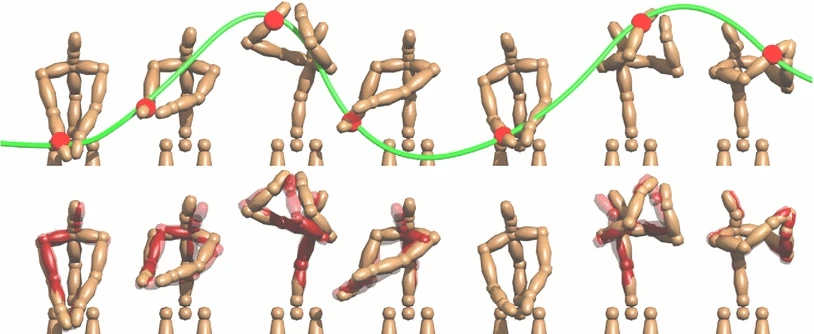
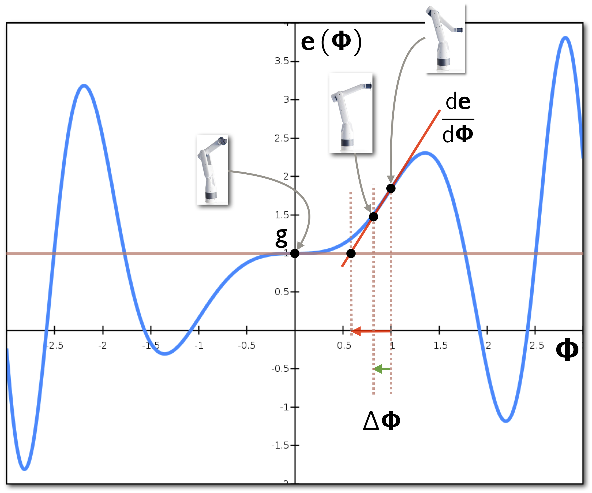
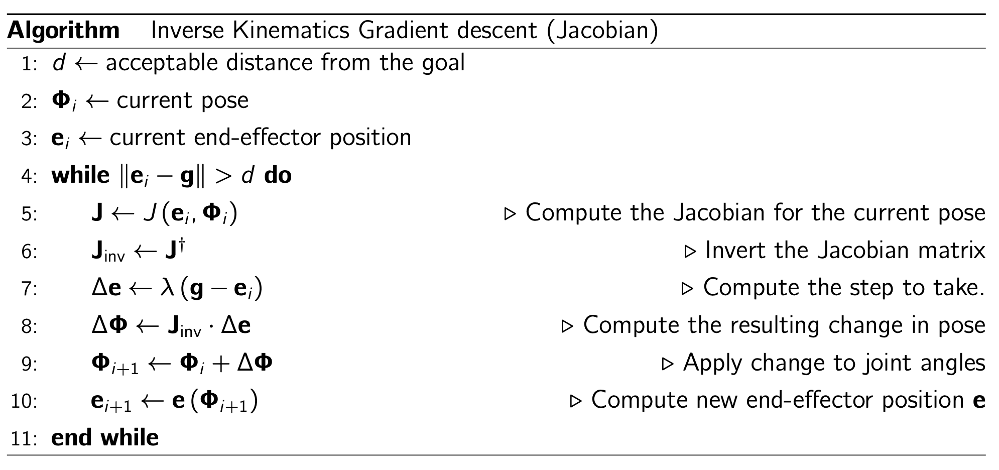

# Inverse Kinematics

## Overview

Inverse kinematics calculates the values of the joint angles that will move the kinematic-chain’s end effector to reach a chosen location. When calculated incrementally, the joint angles calculated by inverse kinematics can be used to create animations of articulated graphical objects such as robot arms. During the animation, the arm’s end effector will move from an initial position until it reaches a chosen goal position. 

The incremental changes in robot-arm poses can be calculated using the gradient-descent algorithm, guided by the Jacobian of the forward-kinematics function. Each gradient-descent iteration yields a pose of the robot arm.  In an initial solution, we are not concerned with obstacle avoidance or limitation in range of motion for the joints. As a result, the cost function we aim at minimizing is a function of the distance between current location of the end effector and the goal position. Figure 1 shows an example of an animation of a golf-swim motion. 

**Figure 1:** Golf swing. *Top*: From the position of the end-effector placed on the *right* hand (*red sphere*).  *Bottom* Comparison between the resulting poses (wood texture) and reference mocap data (transparent *red*). Figure from Huang  *et al.* [1].

These notes are heavily based on the following coursework and tutorial materials: 

- Steve Rotenberg's lectures slides from the CSE 169 Computer Animation course (https://cseweb.ucsd.edu/classes/sp16/cse169-a/sessions.html). The two sets of slides on inverse kinematics are [Part 1](https://cseweb.ucsd.edu/classes/sp16/cse169-a/slides/CSE169_08.pdf) and [Part 2](https://cseweb.ucsd.edu/classes/sp16/cse169-a/slides/CSE169_09.pdf).
- Samuel Buss' notes on Inverse Kinematics (https://www.cs.cmu.edu/~15464-s13/lectures/lecture6/iksurvey.pdf).

## Inverse kinematics

Before looking into inverse kinematics, let us review the concept of forward kinematics applied to the motion of a robot-arm. 

### From forward kinematics to inverse kinematics

The forward-kinematics function calculates the pose of the robot arm given a set of (known) joint angles as input. However, the forward-kinematics function does not solve the problem of moving the arm's end effector to a specific location in space when we do not know the joint angles that perform the desired motion. In this case, we need to compute the *inverse kinematics*, which will compute the joint-angle configuration for a given goal position of the end effector. Inverse kinematics is the inverse of the forward-kinematics function, i.e.: 

$$
\begin{align}
        {\bf \Phi} = f^{-1}\left({\bf e}\right).
	%\label{ik}
\end{align}
$$

This function does not usually have a closed-form solution. In addition, non-linearity will cause it to have multiple solutions. Instead of trying to solve the inverse kinematics directly, we can make progress by using an iterative numerical-minimization method such as the gradient descent. 

### Solving the inverse kinematics numerically

One numerical method used for computing inverse kinematics uses the gradient-descent algorithm, and attempts to find the best incremental changes in joint-angle configuration that take the end effector closer a goal position (and orientation). The best incremental changes of joint angles are calculated by the gradient-descent method by taking steps in the direction of the *inverse gradient* of the forward-kinematics function. Because the forward-kinematics function is a *vector function of vector variables*, the *gradient* vector is replaced by the *Jacobian* matrix. 

The first step to derive the gradient-descent solution for the inverse kinematics is to determine how incremental changes of joint-angle configuration relate to incremental changes of end-effector location, i.e., we want to relate changes in any component of ${\bf \Phi}$ with changes in any component of ${\bf e}$. With this relationship at hand, we can derive an iterative algorithm analogous to the gradient-descent to calculate the arm's pose needed to reach a given location.

#### Relating variations of pose to variations of end-effector location

To relate small changes between values of a function and small variations of its variables, we can use *derivatives*. Indeed, the derivative of the forward-kinematics function, $d{\bf e}/d{\bf \Phi}$, contains all the information we need to know about how to relate changes in any component of $\bf \Phi$ to changes in any component of ${\bf e}$.  Because the forward-kinematics function ${\bf e}$ is a vector-valued function of the vector-valued variable $\bf \Phi$, its  derivative is given by the Jacobian. For example, the Jacobian for a robot arm with 4 joint angles is:  

$$
\begin{align}
          \frac{d\,\bf e}{d\,\bf \Phi}  &= J\left({\bf e},{\bf \Phi}\right) = 
          \begin{bmatrix}
          	 \dfrac{\partial{\bf e}}{\partial\phi_1}  & \dfrac{\partial{\bf e}}{\partial\phi_2}  & \dfrac{\partial{\bf e}}{\partial\phi_3}  & \dfrac{\partial{\bf e}}{\partial\phi_4}
          \end{bmatrix} = 
          \begin{bmatrix}
          	 \dfrac{\partial e_x}{\partial\phi_1}  & \dfrac{\partial e_x}{\partial\phi_2}   & \dfrac{\partial e_x}{\partial\phi_3}  & \dfrac{\partial e_x}{\partial\phi_4}\\[1em]
          	 \dfrac{\partial e_y}{\partial\phi_1}  & \dfrac{\partial e_y}{\partial\phi_2}   & \dfrac{\partial e_y}{\partial\phi_3}  & \dfrac{\partial e_y}{\partial\phi_4}\\[1em]	 
          	 \dfrac{\partial e_z}{\partial\phi_1}  & \dfrac{\partial e_z}{\partial\phi_2}   & \dfrac{\partial e_z}{\partial\phi_3}  & \dfrac{\partial e_z}{\partial\phi_4}	 
	 \end{bmatrix}.          
	%\label{jacobian_e}
\end{align}
$$

The first column vector of this Jacobian matrix, ${\partial{\bf e}}/{\partial\phi_1}$, describes how the end-effector position changes for small changes in the join angle $\phi_1$. Similarly, the second column vector in the matrix, ${\partial{\bf e}}/{\partial\phi_2}$, describes how the end-effector position changes for small changes in the join angle $\phi_2$. Note that each component of the Jacobian matrix in Equation $\ref{jacobian_e}$ is equivalent to a 1st-order derivative of a scalar function of a single variable, and can be approximated numerically using finite differences. The approximated Jacobian is then: 

$$
\begin{align}
          J\left({\bf e},{\bf \Phi}\right) \approx  
          \begin{bmatrix}
          	 \dfrac{\Delta{\bf e}}{\Delta\phi_1}  & \dfrac{\Delta{\bf e}}{\Delta\phi_2}  & \dfrac{\Delta{\bf e}}{\Delta\phi_3}  & \dfrac{\Delta{\bf e}}{\Delta\phi_4}
          \end{bmatrix} =           
          \begin{bmatrix}
          	  \dfrac{\Delta e_x}{\Delta\phi_1}  & \dfrac{\Delta e_x}{\Delta\phi_2}   & \dfrac{\Delta e_x}{\Delta\phi_3}  & \dfrac{\Delta e_x}{\Delta\phi_4}\\[1em]
          	 \dfrac{\Delta e_y}{\Delta\phi_1}  & \dfrac{\Delta e_y}{\Delta\phi_2}   & \dfrac{\Delta e_y}{\Delta\phi_3}  & \dfrac{\Delta e_y}{\Delta\phi_4}\\[1em]	 
          	 \dfrac{\Delta e_z}{\Delta\phi_1}  & \dfrac{\Delta e_z}{\Delta\phi_2}   & \dfrac{\Delta e_z}{\Delta\phi_3}  & \dfrac{\Delta e_z}{\Delta\phi_4}	 
	 \end{bmatrix}.          
	%\label{jacobian_e_approx}
\end{align}
$$

for a small $\Delta \phi_i, i=1,\dots,4$, where the elements of the matrix in ($\ref{jacobian_e_approx}$) are forward finite differences. We can also write the columns of the Jacobian matrix in terms of ${\bf e}\left(\Phi\right)$ as follows:

$$
\begin{align}
        \frac{\Delta {\bf e}}{\Delta \phi_i} = \frac{{\bf e}\left({\bf \Phi}+\Delta \phi_i\right) - {\bf e}\left({\bf \Phi}\right)}{\Delta \phi_i},
	%\label{approxExample}
\end{align}	
$$

for a small $\Delta \phi_i$, and $i=1,\dots,4$. Note that the displacement of the joint angles vector ${\bf \Phi}$ by $\Delta \phi_i$ in the calculation of the incremental variation of the end effector ${\bf e}\left({\bf \Phi}+\Delta \phi_i\right)$ in Equation $\ref{approxExample}$ is applied only to the corresponding joint angle $\phi_i$ which is a component of ${\bf \Phi}$, and not to all components. For example, the position of the end-effector displaced by a small variation of the first joint angle, $\Delta \phi_1$, is:

$$
\begin{align}
       {\bf e}\left({\bf \Phi}+\Delta \phi_1\right) = {\bf e}\left(
       \begin{bmatrix}
       		\phi_1\\   \phi_2\\ \phi_3\\   \phi_4
       \end{bmatrix}
      +
       \begin{bmatrix}
       		\Delta \phi_1\\   0\\ 0\\   0
       \end{bmatrix}      
      \right),
	%\label{incrementPhi}
\end{align}
$$

while the position of the end-effector displaced by a small variation of the second joint angle,  $\Delta \phi_2$, is:

$$
\begin{align}
       {\bf e}\left({\bf \Phi}+\Delta \phi_2\right) = {\bf e}\left(
       \begin{bmatrix}
       		\phi_1\\   \phi_2\\ \phi_3\\   \phi_4
       \end{bmatrix}
      +
       \begin{bmatrix}
       		0\\   \Delta \phi_2\\ 0\\   0
       \end{bmatrix}      
      \right).
	%\label{incrementPhi2}
\end{align}
$$

The other two displacements are calculated analogously. 

#### Numerical example of the Jacobian matrix calculation

For a numerical example of how to compute the Jacobian approximation in Equation $\ref{jacobian_e_approx}$, assume that the current pose of the robot arm is ${\bf \Phi} = \left( 0, \pi/4,  \pi/4, \pi/4\right)^\mathsf{T}$, and that the lengths of the parts are ${L} = \left( 6, 6,  1, 1\right)^\mathsf{T}$, with the base-joint center located at ${\bf p}_1 = \left( 0, 0,  0\right)^\mathsf{T}$. Here, the local frames are described by their individual transformation matrices, and the world-to-frame transformations are computed as described in the notes on forward kinematics. If we set all $\Delta \phi_i = 0.05\degree = (1/20)\times\dfrac{\pi}{180}$ radians, the first column of the approximated Jacobian matrix will be: 

$$
\begin{align}
        \frac{\Delta {\bf e}}{\Delta \phi_1} &= \dfrac{{\bf e}\left({\bf \Phi}+\Delta \phi_1\right) - {\bf e}\left({\bf \Phi}\right)}{\Delta \phi_1} \notag \\
                                                              &= \dfrac{{\bf e}\left(
               \begin{bmatrix}
               		\phi_1\\   \phi_2\\ \phi_3\\   \phi_4
               \end{bmatrix}
              +
               \begin{bmatrix}
               		\Delta \phi_1\\   0\\ 0\\   0
               \end{bmatrix}      
                                                              \right) - {\bf e}\left(
               \begin{bmatrix}
               		\phi_1\\   \phi_2\\ \phi_3\\   \phi_4
               \end{bmatrix}
                                                              \right)}{\Delta \phi_1}  \notag \\
            &=
            \dfrac{{\bf e}\left(
               \begin{bmatrix}
               		0\\   \pi/4\\ \pi/4\\   \pi/4
               \end{bmatrix}
              +
               \begin{bmatrix}
               		\dfrac{1}{20}\times\dfrac{\pi}{180} \\   0\\ 0\\   0
               \end{bmatrix}      
                                                              \right) - {\bf e}\left(
               \begin{bmatrix}
               		0\\   \pi/4\\ \pi/4\\   \pi/4
               \end{bmatrix}
                                                              \right)}{\dfrac{1}{20}\times\dfrac{\pi}{180}}  \notag \\
            &=
            \dfrac{
               \begin{bmatrix}
               		5.9497\\   0.0052\\ 9.5355
               \end{bmatrix}
               -     
               \begin{bmatrix}
               		5.9497\\   0\\ 9.5355
               \end{bmatrix}
                }{\dfrac{1}{20}\times\dfrac{\pi}{180}} 
                = 
               \begin{bmatrix}
               		-0.0026\\   5.9497\\ 0
               \end{bmatrix}.
	%\label{approxExampleNumerical}
\end{align}
$$

The other columns of the matrix are computed analogously. Once all columns are computed, the approximated Jacobian matrix is given by: 

$$
\begin{align}
          J\left({\bf e},{\bf \Phi}\right) \approx       
      \begin{bmatrix*}[r]
         -0.0026  &  3.5329   &-0.7079 &  -0.7074\\
    5.9497    &     0     &    0    &     0\\
         0   &-5.9513  & -1.7068 &  -0.7068
	 \end{bmatrix*}.          
	%\label{jacobian_e_approx_numbers}
\end{align}
$$

Now that we know how to calculate the approximated Jacobian matrix, we have all the ingredients that we need to derive a numerical algorithm similar to the gradient descent to compute inverse kinematics. The algorithm's derivation, which is described in the next sections, follows the same steps of the gradient-descent algorithm for scalar functions.  

## The gradient-descent for inverse kinematics

### How the robot-arm pose changes as a function of end-effector position?

Let $\Delta {\bf \Phi}$ be a vector representing a small change in joint-angle values, which causes the following small change $\Delta{\bf e}$ in the end effector’s position ${\bf e}$. We can write the following mathematical relationship between the derivative of the forward-kinematics function with respect to the joint angles, $\frac{d\bf e}{d\bf \Phi}$, and the rate of change fraction $\frac{\Delta{\bf e}}{\Delta {\bf \Phi}}$, which represents the numerical approximation of the forward-kinematics derivative: 

$$
\begin{align}
          \frac{\Delta{\bf e}}{\Delta {\bf \Phi}} &\approx \frac{d\bf e}{d\bf \Phi}.
          %\label{end_effector_change_dPhi}
\end{align}
$$

We can then re-arrange the above equation to obtain an expression for the approximation of the variation of the variation of the end-effector position, i.e.: 

$$
\begin{align}
          {\Delta{\bf e}} &\approx \frac{d\bf e}{d\bf \Phi}\cdot \Delta {\bf \Phi}.
         % \label{end_effector_change_dPhi2}
\end{align}
$$

Since the derivative of the forward-kinematics function with respect to the joint angles, $\frac{d\bf e}{d\bf \Phi}$, is the Jacobian matrix,  we re-write the relationship for variation of the end effector as:  

$$
\begin{align}
          {\Delta{\bf e}} &\approx 	J\left({\bf e},{\bf \Phi}\right) \cdot \Delta {\bf \Phi}  \notag \\
&\approx 	{J} \cdot \Delta {\bf \Phi}.
          %\label{end_effector_change_dPhi4}
\end{align}
$$

The Jacobian was renamed from $J\left({\bf e},{\bf \Phi}\right)$ to $J$ for simplicity. Equation $\ref{end_effector_change_dPhi4}$ describes an incremental forward-kinematics computation, i.e., a variation in the end-effector position given a variation in joint angles as input. Instead, we want to calculate an incremental inverse kinematics, i.e., the variation of the joint angles given a variation of the end-effector as input. To do that, we need to solve Equation $\ref{end_effector_change_dPhi4}$ for $\Delta {\bf \Phi}$ as follows: 

$$
\begin{align}
           \Delta{\bf e} &\approx {J} \cdot \Delta {\bf \Phi}  \notag\\        
            \Delta {\bf \Phi} &\approx  {J}^{-1} \cdot \Delta {\bf e}.
         % \label{end_effector_change_de}
\end{align}
$$

Often, the Jacobian matrix is not invertible. In fact, this is the case of the Jacobian matrix of the robot arm with four joint angles given as an example in Equation $\ref{jacobian_e_approx}$ (the matrix is not a square matrix therefore it does not have an inverse). Thus, instead of using the inverse of the Jacobian, we will calculate its *pseudo-inverse*. By using the Jacobian's pseudo-inverse, denoted here by ${J}^{\dagger}$, we can re-write Equation $\ref{end_effector_change_de}$ as:  

$$
\begin{align}
            \Delta {\bf \Phi} &\approx  {J}^{\dagger} \cdot \Delta {\bf e}, 
          %\label{end_effector_change_de_pseudo_inverse}
\end{align}
$$

where:

$$
\begin{align}
            {J}^{\dagger} = VD^{-1}U^\mathsf{T}
         % \label{pseudo_inverse}
\end{align}
$$

is the *Moore-Penrose pseudo inverse* of the Jacobian. Here, matrices $U$, $D$, and $V$ are obtained from the Singular Value Decomposition of $J$, i.e., $J = UDV^\mathsf{T}$. 

Thus, given some desired incremental change in the end-effector position, we use ($\ref{end_effector_change_de_pseudo_inverse}$) to compute an appropriate incremental change in joint-angle configuration. 

### Computing the value of  $\Delta {\bf e}$

Equation $\ref{end_effector_change_de}$ depends on the value $\Delta {\bf e}$, which takes the end-effector closer to the goal location. This value is calculated in the next step of our algorithm. Let ${\bf \Phi}$ be the current pose of the robot arm and ${\bf e}$ be the current end-effector position. Also, let ${\bf g}$ be the goal position that we want the end effector to reach. When solving inverse kinematics using an iterative approach (i.e., gradient descent), we want to choose a value for $\Delta{\bf e}$ that will move the end-effector ${\bf e}$ closer to the desired goal ${\bf g}$. A reasonable place to start is by setting: 

$$
\begin{align}
           \Delta{\bf e} = {\bf g}  - {\bf e}.
          %\label{Delta_e}
\end{align}
$$

As in the derivation of the gradient descent for scalar functions, non-linearity prevents the exact solution that would satisfy Equation $\ref{Delta_e}$. Instead, we will take small steps in the direction given by $\Delta{\bf e}$, i.e.: 

$$
\begin{align}
           \Delta{\bf e} = \lambda\left({\bf g}  - {\bf e}\right),
          %\label{Delta_e_beta}
\end{align}
$$

with $\lambda \in \left[0, 1\right]$ is the size of the (fractional) step we will take. 

The basic Jacobian inverse-kinematics algorithm is listed in Algorithm 1. The diagram in Figure 4 shows an analogy between the Jacobian gradient-descent method in and the gradient-descent method for a scalar function of a scalar variable. In the analogy, each value of the function corresponds to a new position of the end-effector (and consequently a new pose of the robot arm).  The input to the function (i.e., horizontal axis) is the set of joint angles. The rate of change of pose (i.e., derivative of the forward-kinematics function with respect to the joint angles) is shown as a red line segment. 

**Figure 4:** Jacobian Inverse Kinematics. Simplified diagram using a 1-D function to represent the forward kinematics cost function. Each value of the function (i.e., on the vertical axis) corresponds to a new position of the end-effector (and consequently a new pose of the robot arm).  The input to the function (i.e., on the horizontal axis) is the set of joint angles. . The rate of change of pose (i.e., derivative of the forward-kinematics function with respect to the joint angles) is shown as a red line segment. 

### The inverse-kinematics algorithm

**Algorithm 1**: Inverse Kinematics Gradient Descent. It calculates incremental variations of the joint angles in the direction given by the inverse of the Jacobian matrix. The inverse of the Jacobian matrix “points” towards the steepest decent of the cost functions, which will (hopefully) lead the algorithm to a local minimum. 

## References

[1] Huang, J., Fratarcangeli, M., Ding, Y. *et al.* Inverse kinematics using dynamic joint parameters: inverse kinematics animation synthesis learnt from sub-divided motion micro-segments. *Vis Comput* **33**, 1541–1553 (2017). https://doi.org/10.1007/s00371-016-1297-x. 
